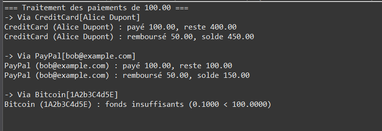

# Exercise 1: Extensible Payment System



## Objective
Understand the role of interfaces in Java to define contracts independent of implementations, decouple business logic from payment details, and practice dynamic array expansion for heterogeneous objects while reinforcing extensibility principles.

## Description
This exercise creates a flexible payment processing system using interfaces to enable multiple payment methods (credit cards, PayPal, Bitcoin) to be handled uniformly. The system demonstrates the Open/Closed Principle: open for extension, closed for modification.

## UML Class Diagram

```
           +------------------------+
           |    PaymentMethod       |  «interface»
           +------------------------+
           | + pay(amount):boolean  |
           | + refund(amount):boolean|
           | + getName():String     |
           +-----------▲------------+
                       |
     +-----------------+-----------------+
     |                 |                 |
+-------------+   +-------------+   +------------+
| CreditCard  |   |   PayPal    |   |  Bitcoin   |
+-------------+   +-------------+   +------------+
| - number    |   | - email     |   | - wallet   |
| - holder    |   | - balance   |   | - balance  |
| - balance   |   +-------------+   +------------+
+-------------+   | + pay()     |   | + pay()    |
| + pay()     |   | + refund()  |   | + refund() |
| + refund()  |   | + getName() |   | + getName()|
| + getName() |   +-------------+   +------------+
+-------------+

          +---------------------------+
          |   PaymentProcessor        |
          +---------------------------+
          | - methods[]:PaymentMethod |
          | - count:int               |
          +---------------------------+
          | + addMethod(m:PM):void    |
          | + processPayments(a):void |
          +---------------------------+
```

## Interface and Classes

### PaymentMethod Interface
Located in `com.example.tp` package

**Contract Definition:**
```java
public interface PaymentMethod {
    /**
     * Attempts to pay the amount.
     * @param amount Amount to debit
     * @return true if payment is accepted
     */
    boolean pay(double amount);

    /**
     * Attempts to refund the amount.
     * @param amount Amount to refund
     * @return true if refund is processed
     */
    boolean refund(double amount);

    /**
     * Returns the payment method name.
     */
    String getName();
}
```

**Key Points:**
- Interface declares methods without implementation
- Any class implementing it must provide these behaviors
- Enables polymorphism without inheritance

### CreditCard Implementation

**Attributes:**
- `number` (String): Card number
- `holder` (String): Cardholder name
- `balance` (double): Available balance

**Constructor:**
```java
public CreditCard(String number, String holder, double balance)
```

**Implementation:**
```java
@Override
public boolean pay(double amount) {
    if (amount <= balance) {
        balance -= amount;
        System.out.printf("CreditCard (%s) : payé %.2f, reste %.2f%n",
                          holder, amount, balance);
        return true;
    }
    System.out.printf("CreditCard (%s) : fond insuffisant%n", holder);
    return false;
}

@Override
public boolean refund(double amount) {
    balance += amount;
    System.out.printf("CreditCard (%s) : remboursé %.2f, solde %.2f%n",
                      holder, amount, balance);
    return true;
}

@Override
public String getName() {
    return "CreditCard[" + holder + "]";
}
```

### PayPal Implementation

**Attributes:**
- `email` (String): PayPal email
- `balance` (double): Account balance

**Constructor:**
```java
public PayPal(String email, double balance)
```

**Implementation:**
```java
@Override
public boolean pay(double amount) {
    if (amount <= balance) {
        balance -= amount;
        System.out.printf("PayPal (%s) : payé %.2f, reste %.2f%n",
                          email, amount, balance);
        return true;
    }
    System.out.printf("PayPal (%s) : fond insuffisant%n", email);
    return false;
}

@Override
public boolean refund(double amount) {
    balance += amount;
    System.out.printf("PayPal (%s) : remboursé %.2f, solde %.2f%n",
                      email, amount, balance);
    return true;
}

@Override
public String getName() {
    return "PayPal[" + email + "]";
}
```

### Bitcoin Implementation

**Attributes:**
- `walletAddress` (String): Crypto wallet address
- `balance` (double): Bitcoin balance

**Constructor:**
```java
public Bitcoin(String walletAddress, double balance)
```

**Implementation:**
```java
@Override
public boolean pay(double amount) {
    if (amount <= balance) {
        balance -= amount;
        System.out.printf("Bitcoin (%s) : payé %.4f BTC, reste %.4f%n",
                          walletAddress, amount, balance);
        return true;
    }
    System.out.printf("Bitcoin (%s) : fond insuffisant%n", walletAddress);
    return false;
}

@Override
public boolean refund(double amount) {
    balance += amount;
    System.out.printf("Bitcoin (%s) : remboursé %.4f BTC, solde %.4f%n",
                      walletAddress, amount, balance);
    return true;
}

@Override
public String getName() {
    return "Bitcoin[" + walletAddress + "]";
}
```

### PaymentProcessor (Manager Class)

**Attributes:**
- `methods` (PaymentMethod[]): Dynamic array of payment methods
- `count` (int): Number of registered methods

**Constructor:**
```java
public PaymentProcessor() {
    methods = new PaymentMethod[3];  // Initial capacity
    count = 0;
}
```

**Methods:**

#### addMethod(PaymentMethod m)
Adds payment method, expanding array if full.
```java
public void addMethod(PaymentMethod m) {
    if (count == methods.length) {
        PaymentMethod[] tmp = new PaymentMethod[methods.length * 2];
        System.arraycopy(methods, 0, tmp, 0, methods.length);
        methods = tmp;
    }
    methods[count++] = m;
}
```

#### processPayments(double amount)
Processes payment and partial refund for each method.
```java
public void processPayments(double amount) {
    System.out.printf("=== Traitement des paiements de %.2f ===%n", amount);
    for (int i = 0; i < count; i++) {
        PaymentMethod m = methods[i];
        System.out.println("-> Via " + m.getName());
        boolean paid = m.pay(amount);
        if (paid) {
            m.refund(amount / 2);  // Refund half
        }
        System.out.println();
    }
}
```

**Key Feature:** PaymentProcessor only knows the interface, remains unchanged when adding new payment methods!

## Example Usage

```java
public class Main {
    public static void main(String[] args) {
        PaymentProcessor processor = new PaymentProcessor();

        // Register payment methods
        processor.addMethod(
            new CreditCard("1234-5678-9012-3456",
                           "Alice Dupont", 500.0)
        );
        processor.addMethod(
            new PayPal("bob@example.com", 200.0)
        );
        processor.addMethod(
            new Bitcoin("1A2b3C4d5E", 0.10)  // Balance in BTC
        );

        // Process transactions
        double montant = 100.0;
        processor.processPayments(montant);
    }
}
```

## Expected Output

```
=== Traitement des paiements de 100.00 ===
-> Via CreditCard[Alice Dupont]
CreditCard (Alice Dupont) : payé 100.00, reste 400.00
CreditCard (Alice Dupont) : remboursé 50.00, solde 450.00

-> Via PayPal[bob@example.com]
PayPal (bob@example.com) : payé 100.00, reste 100.00
PayPal (bob@example.com) : remboursé 50.00, solde 150.00

-> Via Bitcoin[1A2b3C4d5E]
Bitcoin (1A2b3C4d5E) : fond insuffisant (0.10)<100.00>
```

## Compilation & Execution

```bash
# From src/ directory
cd src
javac com/example/tp/*.java
java com.example.tp.Main
```

## Key Concepts Demonstrated

### 1. Interface as Contract
```java
public interface PaymentMethod {
    boolean pay(double amount);
    boolean refund(double amount);
    String getName();
}
```

**Benefits:**
- Defines what, not how
- Multiple implementations possible
- No inheritance required
- Enables polymorphism

### 2. Polymorphism Without Inheritance
```java
PaymentMethod[] methods = new PaymentMethod[10];
methods[0] = new CreditCard(...);
methods[1] = new PayPal(...);
methods[2] = new Bitcoin(...);

// Uniform interface
for (PaymentMethod m : methods) {
    m.pay(100);  // Different implementations called
}
```

### 3. Decoupling
**PaymentProcessor depends on interface, not concrete classes:**
```java
// Processor doesn't know about CreditCard, PayPal, Bitcoin
private PaymentMethod[] methods;  // Only knows interface!

public void processPayments(double amount) {
    for (int i = 0; i < count; i++) {
        methods[i].pay(amount);  // Works for any implementation
    }
}
```

### 4. Open/Closed Principle
**Open for extension, closed for modification:**

**Add new payment method:**
```java
public class ApplePay implements PaymentMethod {
    // Implement interface methods
}

// No changes to PaymentProcessor needed!
processor.addMethod(new ApplePay(...));
```

### 5. Dynamic Array Management
- Starts with capacity 3
- Doubles when full
- No size limit
- Stores heterogeneous objects via interface

## Interface vs. Abstract Class

| Feature | Interface | Abstract Class |
|---------|-----------|----------------|
| Multiple inheritance | Yes | No |
| Fields | Only constants | Any fields |
| Constructors | No | Yes |
| Implementation | None (until Java 8) | Partial allowed |
| Use case | Contract definition | Partial implementation |

**This exercise uses interface because:**
- No common implementation needed
- Each payment method is independent
- Allows future implementations from any class hierarchy

## Verification Checklist
- [ ] Can add multiple payment methods
- [ ] Each method implements all interface methods
- [ ] Dynamic array expands when needed (test with >3 methods)
- [ ] Payment succeeds when balance sufficient
- [ ] Payment fails when balance insufficient
- [ ] Refund always succeeds
- [ ] Can add new payment method without modifying processor

## Possible Extensions

### 1. Transaction Fees Interface
```java
public interface PaymentMethod {
    boolean pay(double amount);
    boolean refund(double amount);
    String getName();
    double getFees();  // New method
}

// Implementation
public class CreditCard implements PaymentMethod {
    @Override
    public double getFees() {
        return 0.029;  // 2.9% fee
    }
}
```

### 2. Exception Handling
```java
public class InsufficientFundsException extends Exception {
    public InsufficientFundsException(double requested, double available) {
        super(String.format("Insufficient funds: requested %.2f, available %.2f",
                           requested, available));
    }
}

// Updated interface
public interface PaymentMethod {
    void pay(double amount) throws InsufficientFundsException;
    void refund(double amount);
    String getName();
}
```

### 3. Transaction Logging
```java
public class PaymentProcessor {
    private List<Transaction> history = new ArrayList<>();

    public void processPayments(double amount) {
        for (PaymentMethod m : methods) {
            boolean success = m.pay(amount);
            history.add(new Transaction(m.getName(), amount, success));
        }
    }

    public void printHistory() {
        for (Transaction t : history) {
            System.out.println(t);
        }
    }
}
```

### 4. Async Payment Processing
```java
public interface PaymentMethod {
    CompletableFuture<Boolean> payAsync(double amount);
    CompletableFuture<Boolean> refundAsync(double amount);
    String getName();
}
```

### 5. Payment Strategy Selection
```java
public class PaymentProcessor {
    public PaymentMethod selectBestMethod(double amount) {
        for (int i = 0; i < count; i++) {
            if (canPay(methods[i], amount)) {
                return methods[i];
            }
        }
        return null;
    }

    private boolean canPay(PaymentMethod m, double amount) {
        // Check balance, fees, etc.
        return true;
    }
}
```

### 6. Multi-Currency Support
```java
public interface PaymentMethod {
    boolean pay(double amount, Currency currency);
    boolean refund(double amount, Currency currency);
    String getName();
    Set<Currency> getSupportedCurrencies();
}
```

## Design Patterns

### Strategy Pattern
**Definition:** Define a family of algorithms, encapsulate each one, and make them interchangeable.

**In this exercise:**
- **Context:** PaymentProcessor
- **Strategy Interface:** PaymentMethod
- **Concrete Strategies:** CreditCard, PayPal, Bitcoin

### Dependency Inversion Principle
**Definition:** Depend on abstractions, not concretions.

**Implementation:**
```java
// High-level module depends on abstraction
public class PaymentProcessor {
    private PaymentMethod[] methods;  // Abstraction, not CreditCard[]!
}
```

## Common Mistakes to Avoid

### 1. Not Implementing All Methods
```java
// Compile error!
public class CreditCard implements PaymentMethod {
    public boolean pay(double amount) { ... }
    // Missing refund() and getName()!
}
```

### 2. Coupling to Concrete Classes
```java
// Bad - tightly coupled
public class PaymentProcessor {
    private CreditCard[] cards;
    private PayPal[] paypalAccounts;
}

// Good - loosely coupled
public class PaymentProcessor {
    private PaymentMethod[] methods;  // Interface!
}
```

### 3. Forgetting @Override
```java
// Typo not caught
public boolean pai(double amount) { ... }  // Wrong name!

// With @Override, compiler catches error
@Override
public boolean pai(double amount) { ... }  // Compile error!
```

## Files
- `PaymentMethod.java`: Interface defining payment contract
- `CreditCard.java`: Credit card implementation
- `PayPal.java`: PayPal implementation
- `Bitcoin.java`: Cryptocurrency implementation
- `PaymentProcessor.java`: Manager with dynamic array
- `Main.java`: Test program demonstrating extensibility
- `subject.txt`: Complete exercise specifications

## Learning Outcomes
- Understanding interfaces as contracts
- Polymorphism without inheritance
- Open/Closed Principle application
- Decoupling business logic from implementations
- Strategy pattern implementation
- Dynamic array management for heterogeneous objects
- Dependency Inversion Principle
