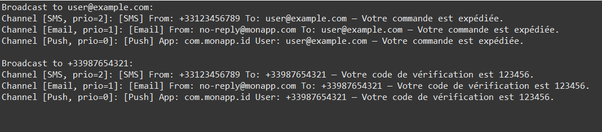

# Exercise 2: Extensible Notification System



## Objective
Understand the role of interfaces in Java to define contracts independent of implementations, decouple business logic from notification details, and practice dynamic array expansion with priority-based sorting while reinforcing extensibility principles.

## Description
This exercise creates a flexible notification broadcasting system using interfaces to enable multiple notification channels (Email, SMS, Push) to be handled uniformly with priority-based ordering. The system demonstrates the Open/Closed Principle: open for extension, closed for modification.

## UML Class Diagram

```
        +---------------------+
        |    Notification     | «interface»
        +---------------------+
        | + send(r, m)        |
        | + getPriority():int |
        | + getType():String  |
        +-----------▲---------+
                    |
    +---------------+---------------+
    |               |               |
+----------+   +-----------+   +--------------+
|   Email  |   |    SMS    |   |     Push     |
+----------+   +-----------+   +--------------+
| - from   |   | - sender  |   | - appId      |
+----------+   +-----------+   +--------------+
| + send() |   | + send()  |   | + send()     |
| + get... |   | + get...  |   | + get...     |
+----------+   +-----------+   +--------------+
Priority: 1    Priority: 2     Priority: 0

        +---------------------------+
        |  NotificationManager      |
        +---------------------------+
        | - channels[]:Notification |
        | - count : int             |
        +---------------------------+
        | + addChannel(n): void     |
        | + broadcast(r,m): void    |
        +---------------------------+
```

## Interface and Classes

### Notification Interface
Located in `com.example.tp` package

**Contract Definition:**
```java
public interface Notification {
    /**
     * Sends notification to recipient.
     * @param recipient Destination address (email, phone, user ID)
     * @param message Message content
     */
    void send(String recipient, String message);

    /**
     * Returns notification priority.
     * @return 0 (low), 1 (normal), 2 (high)
     */
    int getPriority();

    /**
     * Returns notification channel type.
     */
    String getType();
}
```

**Key Points:**
- Interface declares methods without implementation
- Any class implementing it must provide these behaviors
- Enables polymorphism without inheritance
- Priority determines send order

### EmailNotification Implementation

**Attributes:**
- `fromAddress` (String): Sender email address

**Constructor:**
```java
public EmailNotification(String fromAddress)
```

**Implementation:**
```java
@Override
public void send(String recipient, String message) {
    System.out.printf("[Email] From: %s To: %s — %s%n",
        fromAddress, recipient, message);
}

@Override
public int getPriority() {
    return 1;  // Normal priority
}

@Override
public String getType() {
    return "Email";
}
```

**Priority:** 1 (Normal) - reliable but not urgent

### SMSNotification Implementation

**Attributes:**
- `senderNumber` (String): Sender phone number

**Constructor:**
```java
public SMSNotification(String senderNumber)
```

**Implementation:**
```java
@Override
public void send(String recipient, String message) {
    System.out.printf("[SMS] From: %s To: %s — %s%n",
        senderNumber, recipient, message);
}

@Override
public int getPriority() {
    return 2;  // High priority
}

@Override
public String getType() {
    return "SMS";
}
```

**Priority:** 2 (High) - immediate delivery, typically time-sensitive

### PushNotification Implementation

**Attributes:**
- `appId` (String): Application identifier

**Constructor:**
```java
public PushNotification(String appId)
```

**Implementation:**
```java
@Override
public void send(String recipient, String message) {
    System.out.printf("[Push] App: %s User: %s — %s%n",
        appId, recipient, message);
}

@Override
public int getPriority() {
    return 0;  // Low priority
}

@Override
public String getType() {
    return "Push";
}
```

**Priority:** 0 (Low) - may be delayed or batched

### NotificationManager (Manager Class)

**Attributes:**
- `channels` (Notification[]): Dynamic array of notification channels
- `count` (int): Number of registered channels

**Constructor:**
```java
public NotificationManager() {
    channels = new Notification[3];  // Initial capacity
    count = 0;
}
```

**Methods:**

#### addChannel(Notification n)
Adds notification channel, expanding array if full.
```java
public void addChannel(Notification n) {
    if (count == channels.length) {
        Notification[] tmp = new Notification[channels.length * 2];
        System.arraycopy(channels, 0, tmp, 0, channels.length);
        channels = tmp;
    }
    channels[count++] = n;
}
```

#### broadcast(String recipient, String message)
Broadcasts message through all channels, sorted by priority.
```java
public void broadcast(String recipient, String message) {
    // Create copy for sorting
    Notification[] copy = Arrays.copyOf(channels, count);

    // Sort by priority descending (high priority first)
    Arrays.sort(copy,
        Comparator.comparingInt(Notification::getPriority).reversed());

    System.out.println("Broadcast to " + recipient + ":");
    for (Notification n : copy) {
        System.out.printf("Channel [%s, prio=%d]: ",
            n.getType(), n.getPriority());
        n.send(recipient, message);
    }
    System.out.println();
}
```

**Key Features:**
- Priority-based sorting using Java 8 Comparator
- Method reference: `Notification::getPriority`
- Reversed order for high-to-low priority
- Manager only knows interface, unchanged when adding channels!

## Example Usage

```java
public class Main {
    public static void main(String[] args) {
        NotificationManager mgr = new NotificationManager();

        // Register notification channels
        mgr.addChannel(
            new EmailNotification("no-reply@monapp.com")
        );
        mgr.addChannel(
            new SMSNotification("+33123456789")
        );
        mgr.addChannel(
            new PushNotification("com.monapp.id")
        );

        // Broadcast notifications
        mgr.broadcast("user@example.com",
                      "Votre commande est expédiée.");
        mgr.broadcast("+33987654321",
                      "Votre code de vérification est 123456.");
    }
}
```

## Expected Output

```
Broadcast to user@example.com:
Channel [SMS, prio=2]: [SMS] From: +33123456789 To: user@example.com — Votre commande est expédiée.
Channel [Email, prio=1]: [Email] From: no-reply@monapp.com To: user@example.com — Votre commande est expédiée.
Channel [Push, prio=0]: [Push] App: com.monapp.id User: user@example.com — Votre commande est expédiée.

Broadcast to +33987654321:
Channel [SMS, prio=2]: [SMS] From: +33123456789 To: +33987654321 — Votre code de vérification est 123456.
Channel [Email, prio=1]: [Email] From: no-reply@monapp.com To: +33987654321 — Votre code de vérification est 123456.
Channel [Push, prio=0]: [Push] App: com.monapp.id User: +33987654321 — Votre code de vérification est 123456.
```

**Note:** SMS sent first (priority 2), then Email (priority 1), finally Push (priority 0)

## Compilation & Execution

```bash
# From src/ directory
cd src
javac com/example/tp/*.java
java com.example.tp.Main
```

## Key Concepts Demonstrated

### 1. Interface as Contract
```java
public interface Notification {
    void send(String recipient, String message);
    int getPriority();
    String getType();
}
```

**Benefits:**
- Defines what, not how
- Multiple implementations possible
- No inheritance required
- Enables polymorphism

### 2. Priority-Based Sorting
```java
Arrays.sort(copy,
    Comparator.comparingInt(Notification::getPriority).reversed());
```

**How it works:**
- `comparingInt()`: Creates comparator using int-valued function
- Method reference: `Notification::getPriority`
- `reversed()`: Inverts order (high priority first)
- Works with any interface method returning int

### 3. Polymorphism Without Inheritance
```java
Notification[] channels = new Notification[10];
channels[0] = new EmailNotification(...);
channels[1] = new SMSNotification(...);
channels[2] = new PushNotification(...);

// Uniform interface
for (Notification n : channels) {
    n.send(recipient, message);  // Different implementations
}
```

### 4. Decoupling
**NotificationManager depends on interface, not concrete classes:**
```java
// Manager doesn't know about Email, SMS, Push!
private Notification[] channels;  // Only knows interface!

public void broadcast(String recipient, String message) {
    for (Notification n : channels) {
        n.send(recipient, message);  // Works for any implementation
    }
}
```

### 5. Open/Closed Principle
**Open for extension, closed for modification:**

**Add new notification channel:**
```java
public class SlackNotification implements Notification {
    private String webhookUrl;

    @Override
    public void send(String recipient, String message) {
        System.out.printf("[Slack] Webhook: %s Channel: %s — %s%n",
            webhookUrl, recipient, message);
    }

    @Override
    public int getPriority() { return 1; }

    @Override
    public String getType() { return "Slack"; }
}

// No changes to NotificationManager needed!
mgr.addChannel(new SlackNotification("https://hooks.slack.com/..."));
```

### 6. Dynamic Array Management
- Starts with capacity 3
- Doubles when full
- No size limit
- Stores heterogeneous objects via interface

## Comparator and Lambda Expressions

### Traditional Approach (Pre-Java 8)
```java
Arrays.sort(copy, new Comparator<Notification>() {
    @Override
    public int compare(Notification n1, Notification n2) {
        return Integer.compare(n2.getPriority(), n1.getPriority());
    }
});
```

### Modern Approach (Java 8+)
```java
// Using method reference
Arrays.sort(copy,
    Comparator.comparingInt(Notification::getPriority).reversed());

// Equivalent lambda
Arrays.sort(copy,
    (n1, n2) -> Integer.compare(n2.getPriority(), n1.getPriority()));
```

**Benefits of modern approach:**
- More concise
- More readable
- Less error-prone
- Type-safe

## Interface vs. Abstract Class

| Feature | Interface | Abstract Class |
|---------|-----------|----------------|
| Multiple inheritance | Yes | No |
| Fields | Only constants | Any fields |
| Constructors | No | Yes |
| Implementation | None (until Java 8) | Partial allowed |
| Use case | Contract definition | Partial implementation |

**This exercise uses interface because:**
- No common implementation needed
- Each notification channel is independent
- Allows future implementations from any class hierarchy
- Priority is behavior, not state

## Verification Checklist
- [ ] Can add multiple notification channels
- [ ] Each channel implements all interface methods
- [ ] Dynamic array expands when needed (test with >3 channels)
- [ ] Channels sorted by priority (SMS→Email→Push)
- [ ] Broadcast sends to all channels in priority order
- [ ] Can add new channel without modifying manager
- [ ] Method references work correctly

## Possible Extensions

### 1. Return Success Status
```java
public interface Notification {
    boolean send(String recipient, String message);
    int getPriority();
    String getType();
}

// Implementation
public class EmailNotification implements Notification {
    @Override
    public boolean send(String recipient, String message) {
        if (!isValidEmail(recipient)) {
            System.out.println("[Email] Invalid recipient: " + recipient);
            return false;
        }
        System.out.printf("[Email] Sent to %s%n", recipient);
        return true;
    }

    private boolean isValidEmail(String email) {
        return email.contains("@");
    }
}
```

### 2. Exception Handling
```java
public class NotificationException extends Exception {
    public NotificationException(String message) {
        super(message);
    }
}

// Updated interface
public interface Notification {
    void send(String recipient, String message)
        throws NotificationException;
    int getPriority();
    String getType();
}

// Implementation
public class SMSNotification implements Notification {
    @Override
    public void send(String recipient, String message)
            throws NotificationException {
        if (!recipient.startsWith("+")) {
            throw new NotificationException(
                "Invalid phone number format: " + recipient);
        }
        System.out.printf("[SMS] Sent to %s%n", recipient);
    }
}
```

### 3. Notification Filtering
```java
public interface Notification {
    void send(String recipient, String message);
    int getPriority();
    String getType();
    boolean canHandle(String recipient);  // New method
}

// Implementation
public class SMSNotification implements Notification {
    @Override
    public boolean canHandle(String recipient) {
        return recipient.startsWith("+") ||
               recipient.matches("\\d{10}");
    }
}

// Updated broadcast
public void broadcast(String recipient, String message) {
    for (Notification n : channels) {
        if (n.canHandle(recipient)) {
            n.send(recipient, message);
        }
    }
}
```

### 4. Rate Limiting
```java
public interface Notification {
    void send(String recipient, String message);
    int getPriority();
    String getType();
    int getRateLimit();  // Messages per minute
}

public class SMSNotification implements Notification {
    private int sentCount = 0;
    private long lastResetTime = System.currentTimeMillis();

    @Override
    public int getRateLimit() { return 10; }  // 10 SMS/minute

    @Override
    public void send(String recipient, String message) {
        long now = System.currentTimeMillis();
        if (now - lastResetTime > 60000) {
            sentCount = 0;
            lastResetTime = now;
        }

        if (sentCount >= getRateLimit()) {
            System.out.println("[SMS] Rate limit exceeded");
            return;
        }

        System.out.printf("[SMS] Sent to %s%n", recipient);
        sentCount++;
    }
}
```

### 5. Notification Templates
```java
public interface Notification {
    void send(String recipient, String message);
    int getPriority();
    String getType();
    String formatMessage(String template, Map<String, String> params);
}

// Implementation
public class EmailNotification implements Notification {
    @Override
    public String formatMessage(String template,
                                Map<String, String> params) {
        String result = template;
        for (Map.Entry<String, String> entry : params.entrySet()) {
            result = result.replace("{" + entry.getKey() + "}",
                                   entry.getValue());
        }
        return result;
    }
}

// Usage
Map<String, String> params = new HashMap<>();
params.put("name", "Alice");
params.put("code", "123456");
String message = email.formatMessage(
    "Hello {name}, your code is {code}", params);
```

### 6. Asynchronous Notifications
```java
public interface Notification {
    CompletableFuture<Boolean> sendAsync(String recipient,
                                         String message);
    int getPriority();
    String getType();
}

public class EmailNotification implements Notification {
    @Override
    public CompletableFuture<Boolean> sendAsync(String recipient,
                                                 String message) {
        return CompletableFuture.supplyAsync(() -> {
            try {
                Thread.sleep(1000);  // Simulate network delay
                System.out.printf("[Email] Sent to %s%n", recipient);
                return true;
            } catch (InterruptedException e) {
                return false;
            }
        });
    }
}

// Usage
public void broadcast(String recipient, String message) {
    List<CompletableFuture<Boolean>> futures = new ArrayList<>();
    for (Notification n : channels) {
        futures.add(n.sendAsync(recipient, message));
    }
    CompletableFuture.allOf(futures.toArray(new CompletableFuture[0]))
        .join();
}
```

### 7. Notification History
```java
public class NotificationManager {
    private List<NotificationRecord> history = new ArrayList<>();

    public void broadcast(String recipient, String message) {
        for (Notification n : channels) {
            long startTime = System.currentTimeMillis();
            n.send(recipient, message);
            long duration = System.currentTimeMillis() - startTime;

            history.add(new NotificationRecord(
                n.getType(), recipient, message,
                new Date(), duration, true));
        }
    }

    public void printHistory() {
        for (NotificationRecord record : history) {
            System.out.println(record);
        }
    }
}

class NotificationRecord {
    private String type, recipient, message;
    private Date timestamp;
    private long duration;
    private boolean success;

    // Constructor, getters, toString()
}
```

### 8. Multi-Language Support
```java
public interface Notification {
    void send(String recipient, String message, Locale locale);
    int getPriority();
    String getType();
}

public class EmailNotification implements Notification {
    private ResourceBundle getMessages(Locale locale) {
        return ResourceBundle.getBundle("messages", locale);
    }

    @Override
    public void send(String recipient, String message, Locale locale) {
        ResourceBundle messages = getMessages(locale);
        String subject = messages.getString("email.subject");
        String greeting = messages.getString("email.greeting");

        System.out.printf("[Email] To: %s%n", recipient);
        System.out.printf("Subject: %s%n", subject);
        System.out.printf("%s%n%s%n", greeting, message);
    }
}
```

## Design Patterns

### Strategy Pattern
**Definition:** Define a family of algorithms, encapsulate each one, and make them interchangeable.

**In this exercise:**
- **Context:** NotificationManager
- **Strategy Interface:** Notification
- **Concrete Strategies:** EmailNotification, SMSNotification, PushNotification

**Benefits:**
- Algorithms interchangeable at runtime
- Easy to add new notification types
- Manager doesn't depend on concrete implementations

### Dependency Inversion Principle
**Definition:** Depend on abstractions, not concretions.

**Implementation:**
```java
// High-level module depends on abstraction
public class NotificationManager {
    private Notification[] channels;  // Abstraction, not EmailNotification[]!
}
```

**Benefits:**
- Low coupling
- High flexibility
- Easy testing (mock implementations)

## Common Mistakes to Avoid

### 1. Not Implementing All Methods
```java
// Compile error!
public class EmailNotification implements Notification {
    public void send(String r, String m) { ... }
    // Missing getPriority() and getType()!
}
```

### 2. Coupling to Concrete Classes
```java
// Bad - tightly coupled
public class NotificationManager {
    private EmailNotification[] emails;
    private SMSNotification[] smsList;
}

// Good - loosely coupled
public class NotificationManager {
    private Notification[] channels;  // Interface!
}
```

### 3. Forgetting @Override
```java
// Typo not caught
public void sed(String r, String m) { ... }  // Wrong name!

// With @Override, compiler catches error
@Override
public void sed(String r, String m) { ... }  // Compile error!
```

### 4. Wrong Sort Order
```java
// Wrong - low priority first
Arrays.sort(copy,
    Comparator.comparingInt(Notification::getPriority));

// Correct - high priority first
Arrays.sort(copy,
    Comparator.comparingInt(Notification::getPriority).reversed());
```

### 5. Modifying Original Array
```java
// Bad - modifies original order
Arrays.sort(channels, ...);

// Good - sorts copy
Notification[] copy = Arrays.copyOf(channels, count);
Arrays.sort(copy, ...);
```

## Files
- `Notification.java`: Interface defining notification contract
- `EmailNotification.java`: Email channel implementation
- `SMSNotification.java`: SMS channel implementation
- `PushNotification.java`: Push notification implementation
- `NotificationManager.java`: Manager with dynamic array and sorting
- `Main.java`: Test program demonstrating priority-based broadcasting
- `subject.txt`: Complete exercise specifications

## Learning Outcomes
- Understanding interfaces as contracts
- Polymorphism without inheritance
- Open/Closed Principle application
- Decoupling business logic from implementations
- Strategy pattern implementation
- Dynamic array management for heterogeneous objects
- Dependency Inversion Principle
- Priority-based sorting with Comparator
- Method references in Java 8+

## Comparison with Exercise 1

| Feature | Exercise 1 (Payment) | Exercise 2 (Notification) |
|---------|---------------------|--------------------------|
| Interface | PaymentMethod | Notification |
| Return Type | boolean (success) | void |
| Special Feature | Refund capability | Priority sorting |
| Use Case | Financial transactions | Multi-channel alerts |
| Sorting | None | Priority-based |
| Implementations | 3 (Credit, PayPal, Bitcoin) | 3 (Email, SMS, Push) |
| Key Concept | Transaction processing | Broadcast messaging |

Both exercises demonstrate interface-based design and the Strategy pattern!
